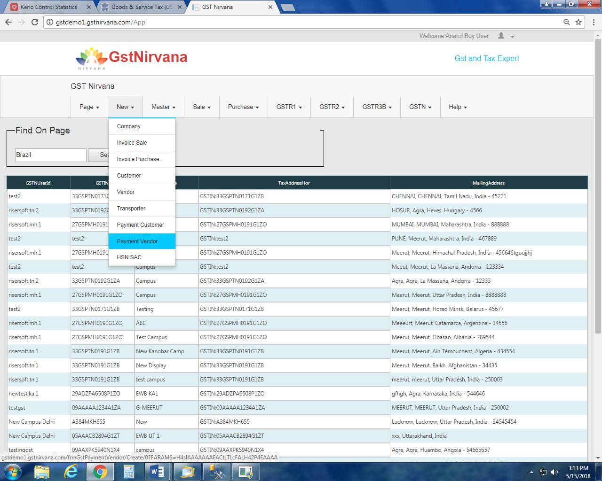

# Advance Paid (Payment Vendor)

## Create

You can create your payment vendor (advance payment given to vendor) by following the given steps:

**STEP-1**: Click on **New tab** and select Payment Vendor. The form will appear.

**STEP-2**: Select  the name of vendor in Vendor field.

**STEP-3**: Enter voucher no. in Voucher No. field.

**STEP-4**: Select Supply Type, Place of Supply, Campus and Division.

**STEP-5**: Click on **Add Item** to enter details of item.

**STEP-6**: Enter the details of item/items.

**STEP-7**: Click on **Save** button.

## List

Click on **Purchase** menu and select **Advances**. The list of payment vendors will display.

## Edit

You can edit payment vendor by following the given steps:

**STEP-1**: **Select** the payment that you want to edit. **Right click** on it and select **Edit Payment Vendor**.

**STEP-2**: Edit the details and click on **Save** button.
